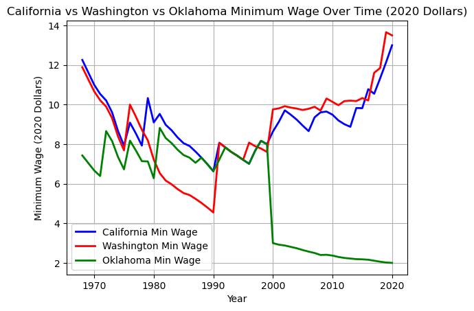
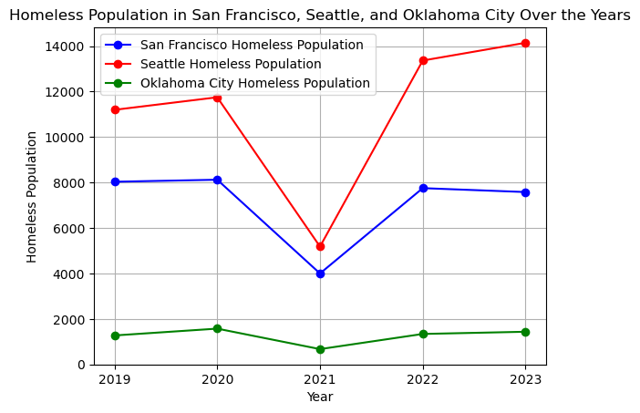
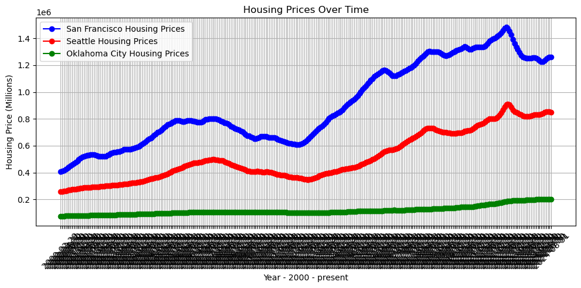

# Housing Inequality in San Francisco 
## In comparison to Seattle and Oklahoma City
##### By Izzy Tilles

My city of interest is San Francisco, where I grew up. In this analysis, I originally sought to show how Seattle and San Francisco differ with minimum wages and homeless populations, since they are both major cities with around 700-800k people. I threw in Oklahoma City for a third data point, since it has a similar population size, after SF and Seattle provided very similar results. The product of this 3 city analysis tells an interesting story that brings into question the effectiveness of a raised minimum wage against other factors in preventing homelessness.

First, here is the way minimum wage has progressed in California [blue], Washington [red], and Oklahoma City [green] (In 2020-equivalent dollars):  
Source: [US Minimum Wage by State from 1968 to 2020](https://www.kaggle.com/datasets/lislejoem/us-minimum-wage-by-state-from-1968-to-2017)


```python
import pandas as pd
import matplotlib.pyplot as plt 

minimum_wage_data = pd.read_csv("minimum_wage_data.csv", encoding='latin1', on_bad_lines='skip')
minimum_wage_data = minimum_wage_data[["Year", "State", "State.Minimum.Wage.2020.Dollars"]]
ca_min_wage = minimum_wage_data[minimum_wage_data["State"] == "California"]
wa_min_wage = minimum_wage_data[minimum_wage_data["State"] == "Washington"]
ok_min_wage = minimum_wage_data[minimum_wage_data["State"] == "Oklahoma"]
```


```python
plt.figure()
plt.plot(ca_min_wage["Year"], ca_min_wage["State.Minimum.Wage.2020.Dollars"], label="California Min Wage", color="blue", lw=2)
plt.plot(wa_min_wage["Year"], wa_min_wage["State.Minimum.Wage.2020.Dollars"], label="Washington Min Wage", color="red", lw=2)
plt.plot(ok_min_wage["Year"], ok_min_wage["State.Minimum.Wage.2020.Dollars"], label="Oklahoma Min Wage", color="green", lw=2)
plt.title("California vs Washington vs Oklahoma Minimum Wage Over Time (2020 Dollars)")
plt.xlabel("Year")
plt.ylabel("Minimum Wage (2020 Dollars)")
plt.legend()
plt.grid(True)
plt.show()
```


    

    


Both Washington and San Francisco experienced similar drastic drops in relative minimum wages starting in the 70's and continuing until 2000. Even when those wages came up in 2000, they stayed low and then stagnated. Finally, they went up to 1970's levels right before 2020, but Washington's minimum wage already shows signs of coming back down.  

Oklahoma tells a different story. When SF and Seattle's wages came up in the 200's, Oklahoma's relative value plummeted. This is because their minimum wage became $2, which it still is today, for jobs in small businesses ([Minimum Wages](https://www.dol.gov/agencies/whd/minimum-wage/state)). Otherwise, it adopts the federal minimum wage, which is also much lower than California and Washington's minimum wages.

This data has 2 drawbacks: It only encapsulates 1968-2020, which leaves out some of the years we are analyzing. However, it shows trends leading up to the present day, and we can infer a lack of progress in terms of minimum wages in both of these states from this data. It makes a lot more sense looking at this graph as to why our grandparents had much easier times buying homes, while people who started entering the workforce in the 90's and 2000's are having a harder time keeping up.  

Another drawback is that the data covers states and not individual cities, which makes this more general data than we want ideally for this analysis. However, it shows trends that we can assume were felt in San Francisco, Seattle, and Oklahoma City because they are such major cities. 

## Homelessness:  
One thing that San Francisco and Seattle share, besides being meccas for the tech boom, is their reputations as cities overrun by a homeless population. But, how large is that homeless population? To analyze this, I will look at their homeless populations over the last 5 years alongside Oklahoma City's, which is a place that does not have any stigma against it related to homelessness. 

Source: Spokane Population Excel Spreadsheet on Canvas


```python
homeless_data = pd.read_csv("homeless_stats.csv")

homeless_data.set_index("CoC Name", inplace=True)
sf_homeless_data = homeless_data.loc["San Francisco CoC", ["2019", "2020", "2021", "2022", "2023"]]
seattle_homeless_data = homeless_data.loc["Seattle/King County CoC", ["2019", "2020", "2021", "2022", "2023"]]
okc_homeless_data = homeless_data.loc["Oklahoma City CoC", ["2019", "2020", "2021", "2022", "2023"]]

years_sf = sf_homeless_data.index
years_seattle = seattle_homeless_data.index
years_okc = okc_homeless_data.index
population_sf = sf_homeless_data.values
population_seattle = seattle_homeless_data.values
population_okc = okc_homeless_data.values

plt.figure()
plt.plot(years_sf, population_sf, label="San Francisco Homeless Population", marker='o', color="blue")
plt.plot(years_seattle, population_seattle, label="Seattle Homeless Population", marker='o', color="red")
plt.plot(years_okc, population_okc, label="Oklahoma City Homeless Population", marker='o', color="green")
plt.title("Homeless Population in San Francisco, Seattle, and Oklahoma City Over the Years")
plt.xlabel("Year")
plt.ylabel("Homeless Population")
plt.legend()
plt.grid(True)
plt.show()

```


    

    


The homeless populations are high in both SF and Seattle, as is shown by their relation to Oklahoma City. All cities experienced a decrease in homelessness in 2021, but due to the isolated nature of that spike and the return to status quo afterwards, we can attribute that to the pandemic.  

The thing to think about now is, why is homelessness so relatively high in San Francisco and Seattle when their state minimum wages are over 5 times greater than Oklahoma's? One reason may be housing prices, which will be discussed in the next graph.

But, it is very interesting to see that SF and Seattle have different levels of homelessness between them as well. One thing I know anecdotally is that San Francisco Mayor London Breed has been facing immense pressure to reduce homelessness in San Francisco and that pressure has only been intensifying during this election year. She has increased sweeps of the streets and shelter placements, but also has piloted programs to help homeless people with transportation in order to get them out of San Francisco ([Journey Home Initiative](https://missionlocal.org/2024/08/san-francisco-homeless-bus-journey-home/#:~:text=Journey%20Home%2C%20run%20jointly%20by,of%20town%20is%20not%20new.)). Therefore, thsi difference may not be too accurate.

## Housing Prices
The next thing to think about in trms of homelessness are housing prices and how much they change.  
Source: ([Zillow Housing Prices](https://www.zillow.com/research/data/))


```python
housing_data = pd.read_csv("zillow.csv", encoding='latin1')

housing_data.set_index("RegionName", inplace=True)

sf_housing_data = housing_data.loc["San Francisco", housing_data.columns[8:]] 
seattle_housing_data = housing_data.loc["Seattle", housing_data.columns[8:]]
okc_housing_data = housing_data.loc["Oklahoma City", housing_data.columns[8:]]

# Transpose the data to get years on the x-axis and prices on the y-axis
sf_housing_data = sf_housing_data.transpose()
seattle_housing_data = seattle_housing_data.transpose()
okc_housing_data = okc_housing_data.transpose()

# Plotting the data
plt.figure(figsize=(10, 5))
plt.plot(sf_housing_data.index, sf_housing_data.values, label="San Francisco Housing Prices", marker='o', color="blue")
plt.plot(seattle_housing_data.index, seattle_housing_data.values, label="Seattle Housing Prices", marker='o', color="red")
plt.plot(okc_housing_data.index, okc_housing_data.values, label="Oklahoma City Housing Prices", marker='o', color="green")
plt.title("Housing Prices Over Time")
plt.xlabel("Year - 2000 - present")
plt.ylabel("Housing Price (Millions)")
plt.xticks(rotation=45)
plt.legend()
plt.grid(True)
plt.tight_layout()
plt.show()
```


    

    


And here we have it - Oklahoma boasts much lower and much more stable housing prices, versus San Francisco and Seattle. One thing to note is that both Seattle and San Francisco have a very volatile housing market due to the tech boom and this has led a lot of people to be displaced. This makes Oklahoma's consistency of house prices even more meaningful - not only can people afford to buy a house there, they can rest assured that the housing market will be predictable while they live there. 

## Cost of Affordable Housing
These cities all spend varied amounts on affordable housing.
First off, Oklahoma City approved \$55.7 million in 2019 to go towards affordable housing ([OKC Affordable Housing](https://www.velocityokc.com/blog/inside-okc/affordable-housing-in-oklahoma-city/)).  
Meanwhile, in 2023 Seattle spent \$147 million on affordable housing ([Seattle Affordable Housing](https://www.seattletimes.com/seattle-news/politics/why-seattle-will-fund-fewer-new-affordable-housing-projects-this-year/#:~:text=The%20housing%20office%20will%20fund,for%20%24380%20million%20this%20year.)).  
Finally, San Francisco's bond measure in 2019 for affordable housing authorized \$600 million to go towards affordable housing. ([SF Affordable Housing](https://www.sf.gov/sites/default/files/2024-02/CGOBOC%202019%20Affordable%20Housing%20Bond_123123.pdf#:~:text=Funds%20will%20be%20used%20for,living%20under%20the%20poverty%20line.&text=Value:%20$20%20million%20Projected%20Units,%25%20and%20140%25%20of%20AMI.)).  

The cost of unaffordable housing is experienced by all San francisco residents. Taxes are raised to fund these measures to build affordable housing. Landlords push the high mortgage payments onto their renters, so rent is high as well. Many people sleep on the streets, usually in survivable weather but still experiencing immense discomfort and a lack of dignity.


## Steps to Take for San Francisco

One step San Francisco should consider is further subsidizing housing options for its poorest citizens. Affordable housing for people to own can be very beneficial, but often people with low incomes can't afford to fron the money to buy a unit. GAP data shows that San Francisco is severely lacking in this area, with 132,227 extremely low income households not having an affordable place to live ([GAP Data](https://nlihc.org/gap/state/CA)). Solving something like this requires contacting your COngress rep and advocating for the federal government to allocate $6.2 billion to affordable public housing ([Congress Petition](https://p2a.co/nliqghj)). Drawbacks here are that taxes will be raised and the federal government might give more stipulations to renters than state or local governments would. 

Another step could be broader rent control. Currently rent control can be positive, but as is noted by the Urban Institute, rent controlled apartments can cause higher prices on other housing since there is a decreased supply ([Urban Institute](https://www.urban.org/sites/default/files/publication/99646/rent_control._what_does_the_research_tell_us_about_the_effectiveness_of_local_action_1.pdf)). In fact, that same study estimates that San Francisco residents experienced a 5.1% increase in rent prices on unregulated houses when stricter rent control rules went into affect. By increasing the reach of rent control, this issue could be mitigated for lower earners and pushed onto those with the highest incomes. This will make being a landlord less attractive, but the current issue of housing inequality in San Francisco is the paramount issue. 

